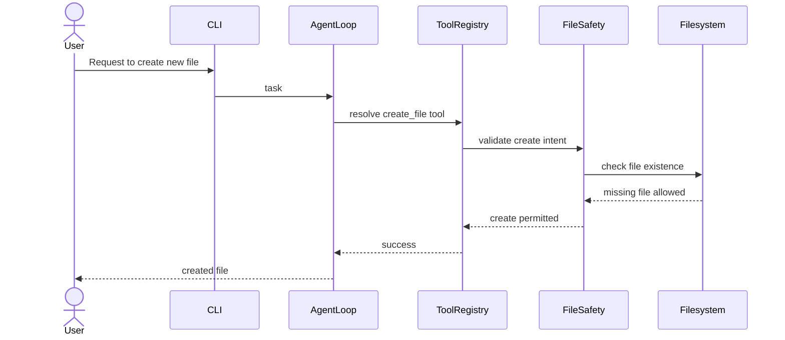
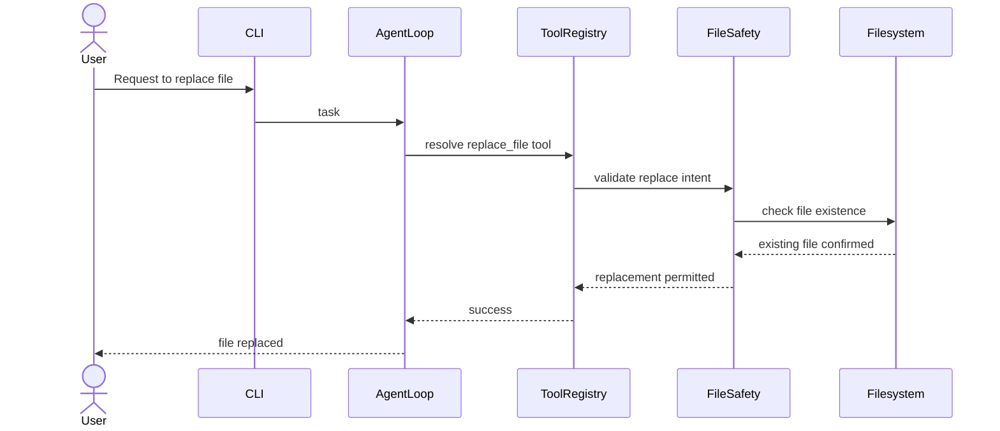
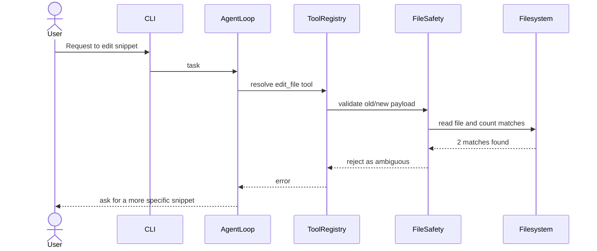

# Sequence diagrams for Milestone 2

## File creation

```mermaid
sequenceDiagram
    actor User
    participant CLI
    participant AgentLoop
    participant ToolRegistry
    participant FileSafety
    participant Filesystem

    User->>CLI: Request to create new file
    CLI->>AgentLoop: task
    AgentLoop->>ToolRegistry: resolve create_file tool
    ToolRegistry->>FileSafety: validate create intent
    FileSafety->>Filesystem: check file existence
    Filesystem-->>FileSafety: missing file allowed
    FileSafety-->>ToolRegistry: create permitted
    ToolRegistry-->>AgentLoop: success
    AgentLoop-->>User: created file
```

## File replacement

```mermaid
sequenceDiagram
    actor User
    participant CLI
    participant AgentLoop
    participant ToolRegistry
    participant FileSafety
    participant Filesystem

    User->>CLI: Request to replace file
    CLI->>AgentLoop: task
    AgentLoop->>ToolRegistry: resolve replace_file tool
    ToolRegistry->>FileSafety: validate replace intent
    FileSafety->>Filesystem: check file existence
    Filesystem-->>FileSafety: existing file confirmed
    FileSafety-->>ToolRegistry: replacement permitted
    ToolRegistry-->>AgentLoop: success
    AgentLoop-->>User: file replaced
```

## Ambiguous edit rejection

```mermaid
sequenceDiagram
    actor User
    participant CLI
    participant AgentLoop
    participant ToolRegistry
    participant FileSafety
    participant Filesystem

    User->>CLI: Request to edit snippet
    CLI->>AgentLoop: task
    AgentLoop->>ToolRegistry: resolve edit_file tool
    ToolRegistry->>FileSafety: validate old/new payload
    FileSafety->>Filesystem: read file and count matches
    Filesystem-->>FileSafety: 2 matches found
    FileSafety-->>ToolRegistry: reject as ambiguous
    ToolRegistry-->>AgentLoop: error
    AgentLoop-->>User: ask for a more specific snippet
```
